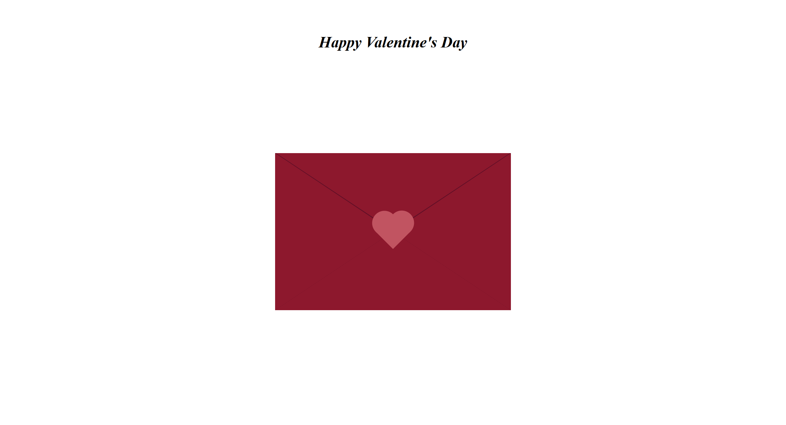
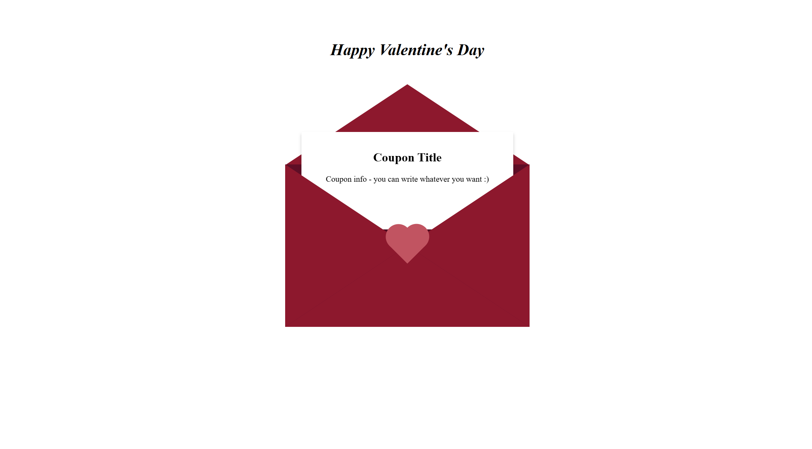

<h1>Valentine's Day Animated Card</h1>

This is a simple Valentine's Day card built using HTML, CSS, and JavaScript. The card features an interactive envelope that opens when clicking on a heart, revealing a customizable message inside.

<h2>Features</h2>

A visually appealing envelope that opens when clicked.

A heart animation that triggers the envelope opening.

A customizable coupon message inside the card.

Responsive design for both desktop and mobile screens.

<h2>Technologies Used</h2>

- HTML: Structure of the page.

- CSS: Styling and animations.

- JavaScript: Event handling for interactivity.

<h2>How It Works</h2>

The envelope is initially closed with a heart at the center.

When the user clicks the heart, the top part of the envelope animates to open.

A hidden message inside the envelope becomes visible.

The card includes responsive design adjustments for different screen sizes.

🚀 <a href="https://elyannmarih.github.io/Valentines-Card/">View Live Demo</a>

Enjoy and share your love with this interactive Valentine's card! 💖
